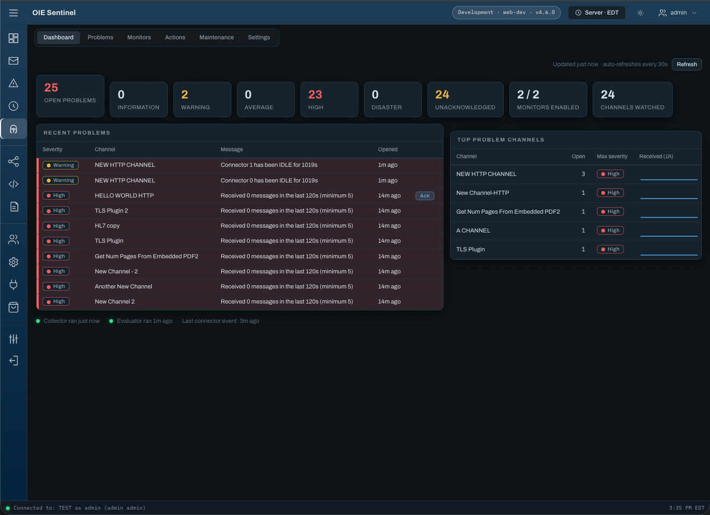
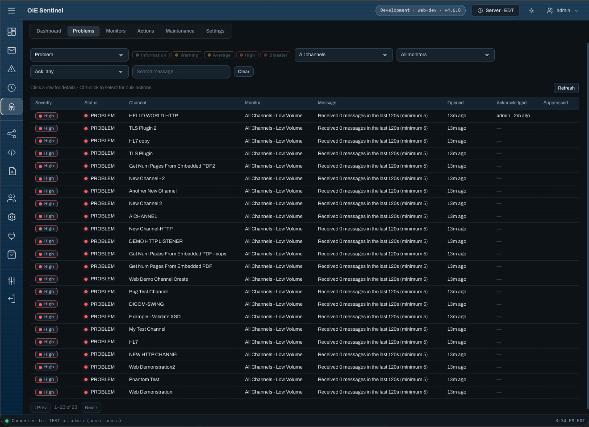
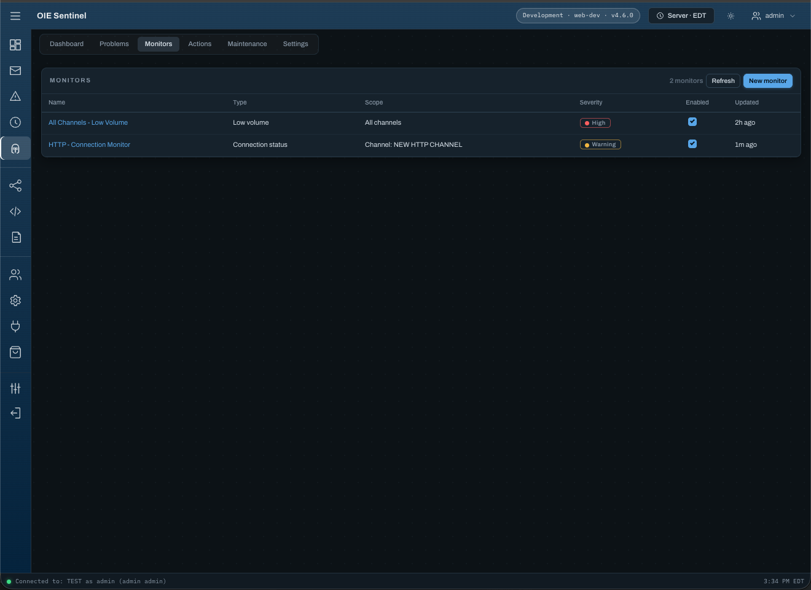
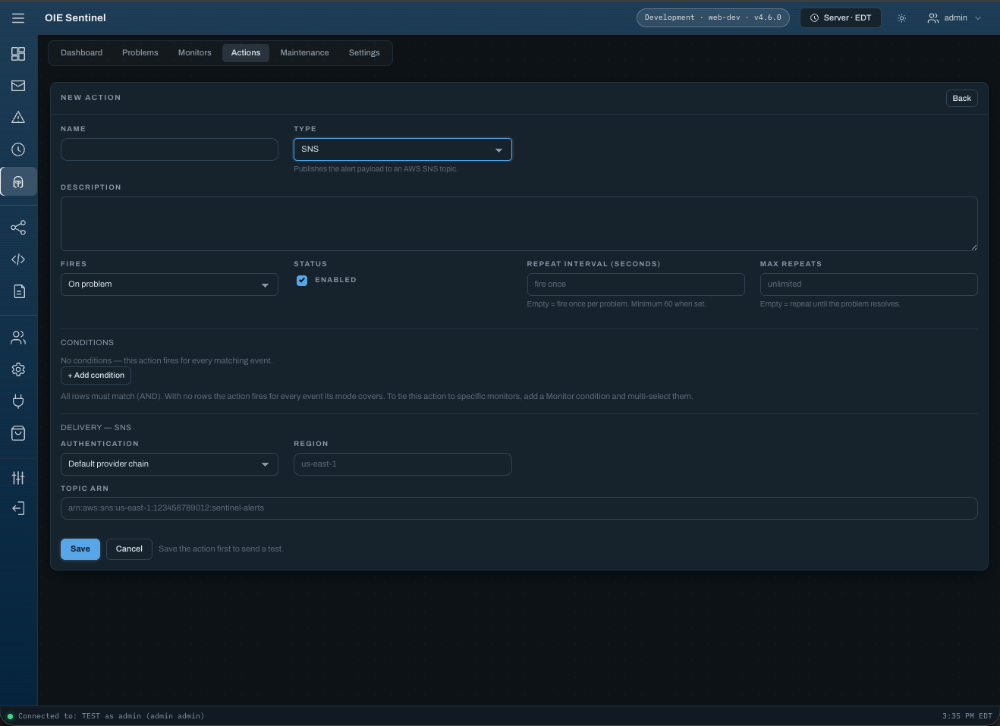
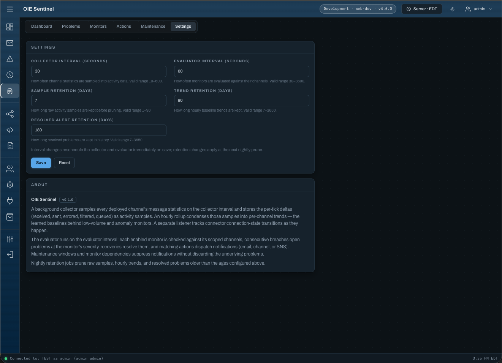

# OIE Sentinel

Zabbix-inspired monitoring and alerting for [Open Integration Engine](https://openintegrationengine.org)
channel activity — inactivity, low-volume, anomaly, connection-status, error-rate and queue-depth
monitors, with email, channel (VM Router), AWS SNS and webhook alert delivery, storm control and
escalation, and a dashboard embedded directly in the OIE Web Administrator.

No Swing desktop client, and no standalone web app either — the UI is built entirely against the
`oie-web-client` plugin contract (`@oie/web-api`/`web-ui`/`web-shell`) and loads inside the main
console, riding its existing session (no separate login).



## Features

**Monitors**
- Six monitor types: **Inactivity** (no messages for N minutes), **Low volume** (fewer than N
  messages per window), **Anomaly** (volume deviates from a rolling baseline), **Connection
  status** (connector state matching), **Error rate** (errored share of received messages over a
  window, with a minimum-volume guard so one error on a quiet channel is not 100%), and **Queue
  depth** (destination queue at or above a threshold for a sustained period).
- Connection-status monitors roll up per connector or once per channel, so one channel losing its
  upstream pages once instead of once per destination.
- Scoped to a single channel, a channel group, a **channel tag**, or all channels — group and tag
  membership resolve live, so reorganizing channels never requires touching monitors.
- Per-monitor severity (Information → Disaster), minimum consecutive breaches, and dependency
  suppression (a parent monitor's open problem silences its dependents on the same channel).

**Problems**
- Problem list with server-side filtering/paging, bulk acknowledge, and a detail pane with the
  captured value and dispatched-action log.
- Acknowledge and manual resolve, each confirmed in a single dialog with an optional comment;
  acknowledgments display the engine username.
- **Acknowledging stops repeat notifications** without resolving the problem — the alarm stays open
  so it cannot re-fire while the condition persists, and the resolve notification still goes out
  when it clears.

**Actions (alert delivery)**
- Email (engine SMTP), Channel (route the alert payload into an OIE channel via VM Router), AWS
  SNS, and Webhook (HTTPS POST to Slack, Teams, PagerDuty, Alertmanager…) senders.
- **Storm control**: a per-action notification ceiling over a rolling window, past which individual
  sends are held and one rollup notification names the affected channels; plus flap detection, so a
  trigger bouncing between problem and OK notifies once and then goes quiet until it settles.
- **Escalation chains**: a problem still open after N seconds routes to a different action — a
  wider audience — with cycle and hop-count guards. Acknowledged problems never escalate.
- Condition-based routing: severity (including `>=` thresholds), monitor type, **specific
  monitors** (multi-select), channel, channel group, **channel tag**, and event type — rows are
  ANDed; an action with no conditions fires for everything its mode covers.
- Repeat notifications per action (`repeat interval` + optional `max repeats`), paced through the
  dispatch log so repeat state survives server restarts.
- Drag-and-drop template tokens (`${monitorName}`, `${channelName}`, `${severity}`, `${status}`,
  `${message}`) for the email subject template.

**Schedules** (the *Schedules* tab)
- **Suppress** schedules — classic maintenance windows: alerts born inside the window never notify.
- **Alerting schedule** windows: the inverse — alerts on covered channels notify *only inside* the
  window (business hours, on-call rotations).
- One-time, weekly (days of week), or monthly (days of month) recurrence with start/end times on a
  **per-window time zone** — pick the zone your on-call rotation lives in and the schedule keeps its
  length across daylight-saving changes there; leave it blank to follow the OIE server's own clock.
  End at or before start wraps past midnight (e.g. 22:00–06:00).
- "Activate now" re-times a one-time window mid-incident without editing it.

**Operations**
- Dashboard tab with problem counts by severity, per-channel activity charts, and top channels.
- Per-monitor history: alert count and mean time-to-resolve over time.
- Optional **runbook URL** per monitor, shown on the problem and available as `${runbookUrl}` in
  every alert template.
- **Prometheus endpoint** at `/extensions/sentinel/metrics` — open problems by severity, per-channel
  throughput, and collector/evaluator heartbeat age, honouring channel restrictions.
- **Export / import** of monitors, actions and schedules as one JSON document, matched by name and
  reported entity by entity, so configuration is promotable dev → test → prod and
  version-controllable.
- Five RBAC permissions published for authorization plugins (see [Permissions](#permissions)).
- Mutations audited through the engine's event log; alert history, trigger state, and activity
  samples persist across restarts with configurable retention.
- **Sizing the sample table:** rows per day is `channels × 86400 / interval`. At the 30-second
  collector default, 200 channels write 576,000 rows a day and stand at roughly 4 million rows
  under the 7-day raw-sample retention default — in the engine's operational database, alongside
  message data. Raise the collector interval or lower the sample retention to size it down. Each
  tick is written as a single batched insert regardless of channel count.

### Activity retention has two independent tiers

Raw collector samples (`sampleRetentionDays`, default 7, max 90) are tick resolution — one row per
watched channel per collector interval — and are what the activity chart's **Raw** granularity
draws. The hourly rollup (`trendRetentionDays`, default 90, max 3650) is a separate tier, written
by the rollup job and pruned on its own schedule, and is what **Hourly** draws.

Neither tier's lifetime derives from the other. A year-long chart is available out of the box at
hourly resolution even though raw samples were pruned after a week, and raising
`sampleRetentionDays` does not lengthen trend history.

**Auto** picks raw for ranges up to 6 hours and hourly beyond that. That is a rule about *range
width*, not about what data still exists — raw samples cover the whole sample-retention window, so
to chart tick resolution across a three-day incident, select **Raw** explicitly.

Any series is capped at 2000 points: a wider range is folded into equal buckets server-side, and
the caption under the chart reports what was actually drawn (for example "hourly rollup, 1h5m
buckets") rather than what was requested.

**Long retention belongs to the hourly tier, not the raw one.** Raw samples are capped at 90 days
precisely because they are 120× denser: at a 30-second collector each channel writes 2,880 raw rows
a day but only 24 hourly ones. A year of history for 200 channels is about 1.75 million hourly rows
— trivial. The same year at raw resolution would be 210 million, which is why it isn't offered.

### Pruning

A nightly job at 03:30 (leadership-gated, so one node in a cluster) removes raw samples, hourly
buckets and resolved alerts past their retention. Open problems are never pruned regardless of age,
and dispatch history follows its alert out by cascade. Retention values are re-read on every run, so
a settings change takes effect that night with no restart.

Deletes run in bounded passes of 5,000 rows rather than one statement, each its own transaction.
This matters for one specific operation: **lowering** a retention setting. Dropping
`sampleRetentionDays` from 90 to 7 asks the next prune to remove 83 days at once — roughly 48
million rows for 200 channels — and as a single transaction that means a long table lock, a
transaction log sized for the whole delete, and on PostgreSQL enough dead tuples to need a manual
`VACUUM`. Chunking bounds all three, and an interrupted prune simply leaves the remainder for the
next night.

## Screenshots

| | |
| --- | --- |
|  |  |
|  |  |

## Requirements

- OIE engine **4.6.0+** (`minEngineVersion` in `oie.json`)
- [oie-web-client](https://github.com/gibson9583/oie-web-client) (OIE Web Administrator) to host
  the dashboard UI
- Server restart after install/upgrade

### Clustered deployments

Sentinel is safe to install on every node of a clustered engine. Background work — the collector,
evaluator, hourly rollup and retention prune — is gated on a database-backed leadership lease
(`sentinel_node_lease`), so exactly one node does it at a time while the others stand by. Without
that gate, two nodes sharing a database would each write a full set of activity samples, doubling
every message delta and corrupting every volume baseline, while both evaluators raced on the same
trigger rows.

The REST API and dashboard serve from **any** node, leader or not — only the scheduled work is
gated.

Failover is automatic. A clean shutdown hands the lease over within about 30 seconds; an abrupt
node loss takes up to about 2 minutes (a 90-second lease plus the next node's heartbeat). The new
leader's first collector tick records zero deltas rather than counting each channel's lifetime
total as one interval, so one tick of sampling is lost on failover by design. Leadership changes
are logged at INFO, naming the node — the first thing to check during an HA incident.

## Install

1. Download `sentinel-<version>.zip` from [Releases](https://github.com/gibson9583/oie-sentinel/releases)
   (or install from an OIE Community Store that lists this plugin).
2. Install via the Web Administrator (Settings → Extensions) or drop the zip into the engine's
   extension install flow, then restart the server.
3. On first start the migrator creates nine `sentinel_*` tables in the engine database (Derby,
   PostgreSQL, MySQL, Oracle, and SQL Server DDL included); schema upgrades run automatically on
   later versions.

### Uninstalling does not delete your data

Uninstalling the extension **renames** the `sentinel_*` tables to
`sentinel_<table>_uninstalled_<yyyyMMdd>` on the next startup rather than dropping them, so
monitors, actions, windows, and alert history survive an accidental uninstall — the kind of record
an audit asks for six months later. Reinstalling creates a fresh schema alongside the renamed
tables; it does not adopt them, so restoring old data is a manual copy.

Clean the archives up yourself when you are sure, for example:

```sql
DROP TABLE sentinel_alert_event_uninstalled_20260806;
-- …and the other eight, child tables first
```

> **Derby exception:** on Derby the tables are left in place under their original names and nothing
> is renamed. Derby refuses to rename any table referenced by a foreign key, and three of the nine
> are; renaming only the six it permits would leave a half-schema that the migrator would correctly
> refuse to start against. Reinstalling on Derby cleanly adopts the existing tables.

Upgrading never triggers any of this — install the new version over the old one.

## Permissions

Sentinel publishes five extension permissions so RBAC-style authorization plugins can map real
operational roles:

| Permission | Grants |
| --- | --- |
| View Monitoring | All reads: dashboard, problems, monitors, actions, windows, activity |
| Acknowledge Problems | Acknowledge, bulk acknowledge, manual resolve |
| Manage Schedules | Schedule create/update/delete and "activate now" (on-call tier) |
| Manage Monitoring | Monitor and action authoring, including delivery credentials and test sends |
| Manage Settings | Scheduler intervals and data retention only |

Delivery credentials — SNS access keys and role ARNs — and recipient lists are part of an action's
configuration, so they belong to Manage Monitoring. Manage Settings covers only the five
scheduler-interval and retention values on the Settings page.

Without an authorization plugin installed, the engine permits everything.

## Build

Requires **JDK 21+** (the 4.6.0 engine jars are Java 21 bytecode; the plugin itself targets
`--release 17`). On a fresh machine or wiped `~/.m2`, first install the 4.6.0 engine jars into the
local Maven repository (the public repsy mirror does not carry every engine version) — the engine
must be built first so its `setup/` output jars exist:

```bash
ENGINE_DIR=/path/to/engine ./scripts/install-engine-jars.sh
```

Then:

```bash
./build.sh          # or: mvn clean package
```

Output: `package/target/sentinel-<version>.zip` — the installable extension archive, including the
built `webadmin/` dashboard bundle. CI does the same, sourcing the engine jars from the published
OIE distribution tarball instead of a local checkout (see `.github/workflows/build.yaml`).

## Project structure

```
oie-sentinel/
├── shared/     JAX-RS interface (SentinelServletInterface) + DTOs
├── server/     ServicePlugin, migrator, repositories, collector/evaluator jobs, alert senders
├── package/    plugin.xml, per-vendor MyBatis mappers, assembly.xml
├── webadmin/   the entire dashboard UI (embedded plugin for the OIE Web Administrator)
└── build.sh    orchestrates mvn package (builds webadmin/ via frontend-maven-plugin) + zip
```

## Releasing

```bash
git tag v1.0.0 && git push origin v1.0.0
```

The tag must match `oie.json`'s `version`. CI builds the bundle, stages a **draft** GitHub Release
with the zip and its `.sha256` sidecar; publishing the release (a human step) triggers the optional
catalog PR that files the version manifest to the community catalog configured via the
`CATALOG_REPO` Actions variable and `CATALOG_TOKEN` secret. Tags containing a hyphen (e.g.
`v0.2.0-rc1`) publish as pre-releases.

## Design

See [`docs/ARCHITECTURE.md`](docs/ARCHITECTURE.md) for the full schema, REST API,
collection/evaluation pipeline, and web-UI design this project was scaffolded from.

## License

[MPL-2.0](LICENSE)
